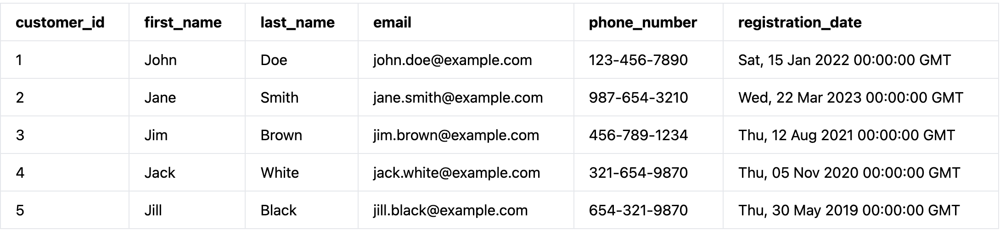
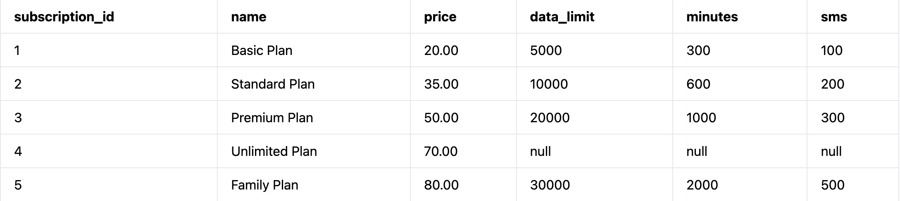
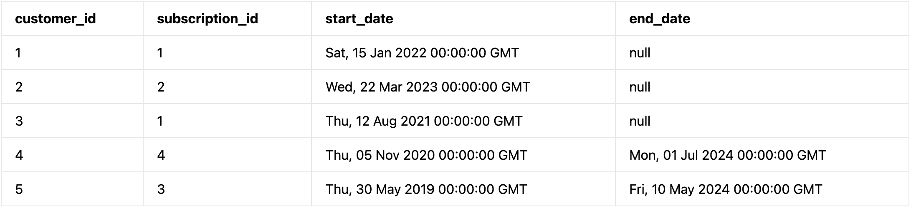
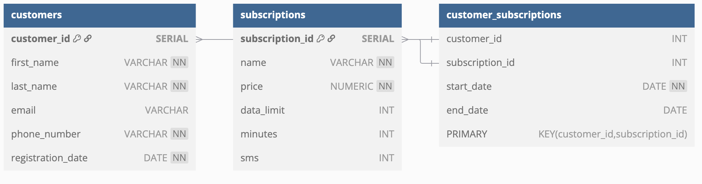

## Simyo Test Assignment - SQL Task 

•	Ga naar https://pgplayground.com 

•	Kopieër en plak de onderstaande statements 

```
-- Tabel: customers
CREATE TABLE customers (
    customer_id SERIAL PRIMARY KEY,
    first_name VARCHAR NOT NULL,
    last_name VARCHAR NOT NULL,
    email VARCHAR UNIQUE,
    phone_number VARCHAR NOT NULL,
    registration_date DATE NOT NULL
);

INSERT INTO customers (first_name, last_name, email, phone_number, registration_date) VALUES
('John', 'Doe', 'john.doe@example.com', '123-456-7890', '2022-01-15'),
('Jane', 'Smith', 'jane.smith@example.com', '987-654-3210', '2023-03-22'),
('Jim', 'Brown', 'jim.brown@example.com', '456-789-1234', '2021-08-12'),
('Jack', 'White', 'jack.white@example.com', '321-654-9870', '2020-11-05'),
('Jill', 'Black', 'jill.black@example.com', '654-321-9870', '2019-05-30');

-- Tabel: subscriptions
CREATE TABLE subscriptions (
    subscription_id SERIAL PRIMARY KEY,
    name VARCHAR NOT NULL,
    price NUMERIC NOT NULL,
    data_limit INT,
    minutes INT,
    sms INT
);

INSERT INTO subscriptions (name, price, data_limit, minutes, sms) VALUES
('Basic Plan', 20.00, 5000, 300, 100),
('Standard Plan', 35.00, 10000, 600, 200),
('Premium Plan', 50.00, 20000, 1000, 300),
('Unlimited Plan', 70.00, NULL, NULL, NULL),
('Family Plan', 80.00, 30000, 2000, 500);


-- Tabel: customer_subscriptions
CREATE TABLE customer_subscriptions (
    customer_id INT,
    subscription_id INT,
    start_date DATE NOT NULL,
    end_date DATE NULL,
    PRIMARY KEY (customer_id, subscription_id),
    FOREIGN KEY (customer_id) REFERENCES customers(customer_id),
    FOREIGN KEY (subscription_id) REFERENCES subscriptions(subscription_id)
);

INSERT INTO customer_subscriptions (customer_id, subscription_id, start_date, end_date) VALUES
(1, 1, '2022-01-15', NULL),
(2, 2, '2023-03-22', NULL),
(3, 1, '2021-08-12', NULL),
(4, 4, '2020-11-05', '2024-07-01'),
(5, 3, '2019-05-30', '2024-05-10');

select * from customers;

select * from subscriptions;

select * from customer_subscriptions;
```





## Opdrachten

•	**Opdracht 1**: 

Query alle klanten met een Basic Plan


```
SELECT c.*
FROM customers c
JOIN customer_subscriptions cs ON c.customer_id = cs.customer_id
JOIN subscriptions s ON cs.subscription_id = s.subscription_id
WHERE s.name = 'Basic Plan';
```

|customer_id|first_name|last_name|email|phone_number|registration_date|
|-|-|-|-|-|-|
|1|	John |Doe|john.doe@example.com|123-456-7890|Sat, 15 Jan 2022 00:00:00 GMT|
|3|	Jim	|Brown|jim.brown@example.com|456-789-1234|Thu, 12 Aug 2021 00:00:00 GMT|


•	**Opdracht 2**: 

Totaal aantal minuten en totale data per abonnementstype voor actieve abonnementen

```
SELECT 
    s.name AS subscription_name,
    SUM(s.minutes) AS total_minutes,
    SUM(s.data_limit) AS total_data
FROM subscriptions s
JOIN customer_subscriptions cs ON s.subscription_id = cs.subscription_id
WHERE cs.end_date IS NULL
GROUP BY s.name;
```
|subscription_name|total_minutes|total_data|
|-|-|-|
|Basic Plan|600|10000|
|Standard Plan|600|10000|


•	**Opdracht 3**:

Schrijf een query die voor elke klant de totale kosten van hun abonnementen en het aantal verschillende abonnementen toont

```
SELECT 
    c.customer_id,
    c.first_name,
    c.last_name,
    SUM(s.price) AS total_cost,
    COUNT(DISTINCT cs.subscription_id) AS subscription_count
FROM customers c
JOIN customer_subscriptions cs ON c.customer_id = cs.customer_id
JOIN subscriptions s ON cs.subscription_id = s.subscription_id
GROUP BY c.customer_id, c.first_name, c.last_name;
```

|customer_id|first_name|last_name|total_cost|subscription_count|
|-|-|-|-|-|
|1|John|Doe|20.00|1|
|2|Jane|Smith|35.00|1|
|3|Jim|Brown|20.00|1|
|4|Jack|White|70.00|1|
|5|Jill|Black|50.00|1|
